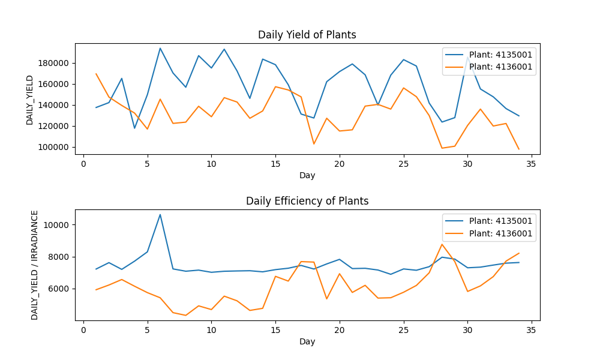
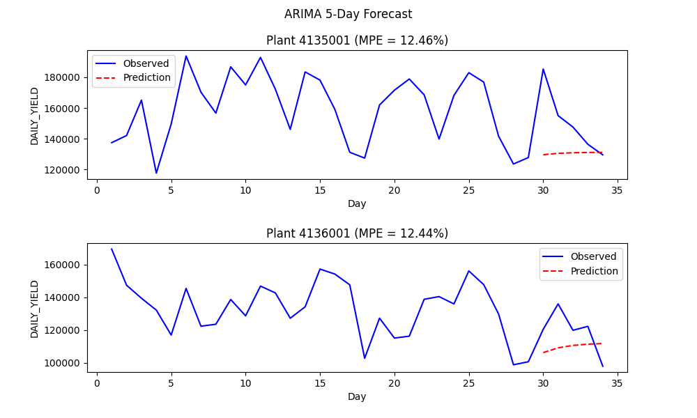
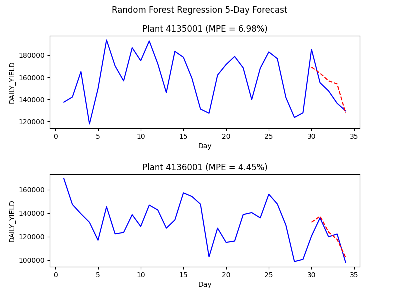
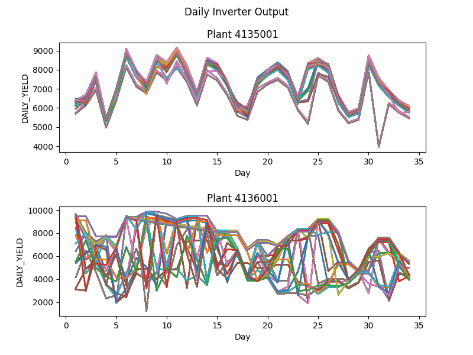

# Machine Learning Visualization Demo

## Overview
The following is a demo that forecasts the output of a solar power plant and detectects anomolies. The purpose of this demo is to showcase an example project that uses multiple machine learning techniques for analysis and communicates the results for data-driven decisions. It has be broken down into the following sections:
* [Problem Statment](#problem-statement)
* [Results](#results)
* [Running the Analysis](#re-running-the-analysis)
* [Dataset Details](#dataset-details)

## Problem Statement
Data has been gathered at two solar power plants over a 30+ day period. Each power plant has one power generation dataset and one sensor readings dataset. The power generation datasets are gathered at the inverter level - each inverter has multiple lines of solar panels attached to it. The sensor data is gathered at a plant level - single array of sensors optimally placed at the plant. The goal is to analyze the data to answer the following questions:

1. **How accurately can power generation be forecasted?**
2. **Can plant-wide panel cleaning/maintenance be identified?**
3. **Can faulty/suboptimally performing equipment be identified?**

## Results
### Summary
This report provides answers to the three questions posed for the take home assignment:
 * **How accurately can power generation be forecasted?**
     * A random forest regressor with a month of data was able to predict power plant yield to ~5% when given the forecasted temperature and irradiance for a day.
 * **Can plant-wide panel cleaning/maintenance be identified?**
     * The data provided did not indicate any need for plant-wide maintenance. 
 * **Can faulty/suboptimally performing equipment be identified?**
     * Yes. Inverters 1BY6WEcLGh8j5v7 and bvBOhCH3iADSZry in Plant 4135001 performed suboptimally in several instances.

### Visualizing Plant Output
The first task was to visualize the power output of each plant below to get a good handle on the data and to provide a check for further statistical analysis. There was also a quick check done to answer one of key questions posed, **Can plant-wide panel cleaning/maintenance be identified?**, by examining the efficiency of each plant, defined as energy yield / irradiance.

While the daily yield for Plant 4136001 appears to have a noticeable downward trend over the month, an examination of its efficiency looks to increase slightly. While this might be due to a faulty irradiance sensor, no results can be drawn from this data with reasonable confidence.

### Forecasting
To answer the question **How accurately can power generation be forecasted?**, two different prediction techniques were used, autoregressive integrated moving average (ARIMA) and random forest regressoer (RFR), to predict the output of the last 5 days of the data sample given the previous 29.

### Autoregressive integrated moving average (ARIMA)
The results of the moving average are shown in the figure below. 

Because this technique does not use weather data, an average based on previous data will be just that. This method, while robust, results in a mean percent average (MPE) of **12.4%** for both plants. These mediocre results motivated a forecasting technique that would include weather data, which would be reasonably known 5 days ahead of time.

### Random forest regression (RFR)
The results of RF regression are shown below

These results are much better than the ARMIA technique with an MPE of forcasts for both plants of **~5%**. This is primarily because this method is able leverage weather data which would generally be known ahead of time. Due to the randomness this method requires, the results won't be identical if the program is run again, but the qualitave improvement will remail.

### Identification of suboptimal equipment
Once again, the data was visualized to provide a check for further statistical analysis.

The data for Plant 4135001 is much smoother than the data for Plant 4136001, and we can see that there are at least two inverters in Plant 4135001 that seem to underperform. To identify them and answer **Can faulty/suboptimally performing equipment be identified**, the daily yield for each inverter in each plant were fit to a Weibull distribution. Then a report was generated for underperforming inverters, defined by being 3 standard deviations below the mean. None of the inverters in Plant 413600 were identified as suboptimal by this metric.

<pre>
Plant 4135001 analysis
Day 1 Outliers: (% of daily maximum produced)
bvBOhCH3iADSZry (11.8%)
Day 6 Outliers: (% of daily maximum produced)
bvBOhCH3iADSZry (10.7%)
Day 19 Outliers: (% of daily maximum produced)
bvBOhCH3iADSZry (10.1%)
Day 24 Outliers: (% of daily maximum produced)
1BY6WEcLGh8j5v7 (36.9%) bvBOhCH3iADSZry (38.1%)
Day 31 Outliers: (% of daily maximum produced)
1BY6WEcLGh8j5v7 (47.1%) bvBOhCH3iADSZry (47.9%)
Plant 4136001 analysis
</pre>

## Re-running the analysis 
The following commands can be entered in a console to generate the above results. The program will pause at each figure. It can be continued by closing the figure.

`>>python -m virtualenv venv`

`>>source venv/bin/activate (on Linux) OR venv\Scripts\activate (on Windows)`

`>>pip install -r requirements.txt`

`>>python .\main.py`

## Dataset Details 
The source data consists of 2 tables, *Plant_2_Generation_Data.csv* and *Plant_2_Weather_Sensor_Data.csv*

* Plant_2_Generation_Data consist of following features:
    * DATE_TIME - Date and time for each observation. Observations recorded at 15 minute intervals.
    * PLANT_ID - Power plant ID.
    * SOURCE_KEY - Stands for the inverter id.
    * DC_POWER - Amount of DC power generated (kW) by the inverter (source_key) in this 15 minute interval.
    * AC_POWER - Amount of AC power generated (kW) by the inverter (source_key) in this 15 minute interval.
    * DAILY_YIELD - Cumulative sum of power generated on that day, till that point in time.
    * TOTAL_YIELD - Total yield for the inverter (source_key) till that point in time.
* Plant_2_Weather_Sensor_Data consist of the following features:
    * DATE_TIME - Date and time for each observation. Observations recorded at 15 minute intervals.
    * PLANT_ID - Power plant ID.
    * SOURCE_KEY - Stands for the sensor panel id. This is common for the entire file because there's only one sensor panel for collecting weather data the plant.
    * AMBIENT_TEMPERATURE - Ambient temperature at the plant.
    * MODULE_TEMPERATURE - There's a module (solar panel) attached to the sensor panel. This is the temperature reading for that module.
    * IRRADIATION - Amount of irradiation.
